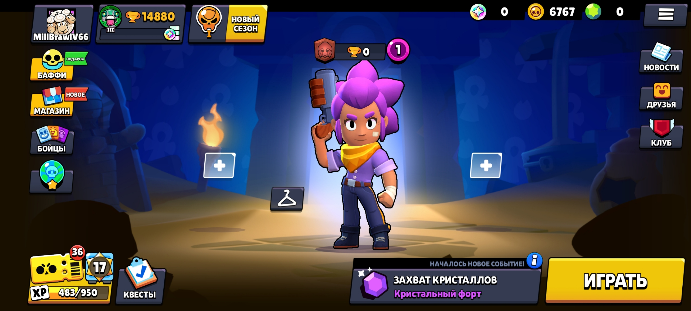

# Автор сурса @KakaoMill - t.me/MillBrawl ы

# MILL-V66 — Node.js server

## Requirements

- Node.js ≥ 18 (no external dependencies)

## Running

```bash
node Server.js
```

The server listens on `0.0.0.0:9339`.

## Screenshot



## Project structure

```
Server.js                          ← entry point (TCP accept loop)
Gate/
  Message.js                       ← packet dispatcher
Core/
  Byte/
    Stream.js                      ← binary read/write helpers (VInt, etc.)
  Logger.js                        ← coloured terminal output
  Piranha.js                       ← outgoing message wrapper (builds 7-byte header)
Message/
  Receive/Login/
    Hello.js                       ← handles packet 10100
    Auth.js                        ← handles packet 10101
  Transmit/Login/
    Hello.js                       ← sends packet 20100
    AuthOk.js                      ← sends packet 20104
  Transmit/Home/
    OwnData.js                     ← sends packet 24101 (placeholder)
```

## Protocol

Each message uses a 7-byte header:

| Bytes | Field   |
|-------|---------|
| 0–1   | Message ID (u16 big-endian) |
| 2–4   | Payload length (u24 big-endian) |
| 5–6   | Version (u16 big-endian) |

Followed by `length` bytes of payload.
